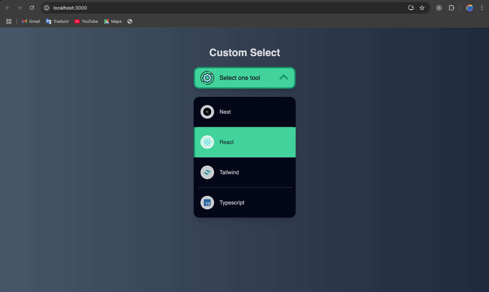

# Hit me hard and soft >;)

# Custom Select

This is a custom select dropdown with icons and nice hover effects.

(all projects are responsive)

### Built with

- react
- tailwind
- css
- spring

### Getting Started with Create React App

This project was bootstrapped with [Create React App](https://github.com/facebook/create-react-app).

### Available Scripts

In the project directory, you can run:

- step 1: run `npm install --legacy-peer-deps` (wait untill all node-modules are in place) 

- step 2: run `npm start` (open the project in the browser)

Runs the app in the development mode.\
Open [http://localhost:3000](http://localhost:3000) to view it in your browser.

The page will reload when you make changes.\
You may also see any lint errors in the console.

### License

 
